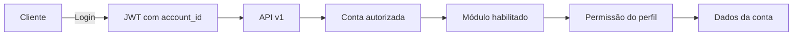

# API REST do Star Tracker: guia completo

Este documento é a referência única da API REST do Star Tracker. A API usa
Django REST Framework, é versionada sob `/api/v1/` e autentica clientes com JWT
no formato Bearer.

Rotas iniciadas por `/api/` aceitam qualquer hostname HTTP válido, inclusive
`10.0.2.2` no emulador Android. `ALLOWED_HOSTS` restringe somente portal, admin e
WebSockets. A API continua protegida por autenticação, permissões e rate limits.

O CORS é aplicado apenas a `/api/` e aceita as origens listadas em
`CORS_ALLOWED_ORIGINS`. Host e origem são conceitos diferentes: aplicativos
nativos não aplicam CORS; clientes executados em navegador devem cadastrar cada
origem permitida ou habilitar `CORS_ALLOW_ALL_ORIGINS` conscientemente.

## Fluxo geral

1. Obtenha os tokens informando usuário, senha e conta.
2. Envie o `access` em todas as requisições protegidas.
3. Acesse somente recursos autorizados para o perfil naquela conta.
4. Renove o `access` com o `refresh` quando necessário.
5. Faça um novo login para trabalhar em outra conta.



## 1. Autenticação

### Login comum

`identifier` aceita username ou e-mail. `account_id` pode ser omitido somente
quando o usuário pertence a exatamente uma conta.

```http
POST /api/v1/auth/token/
Content-Type: application/json

{
  "identifier": "usuario@example.com",
  "password": "senha-segura",
  "account_id": 1
}
```

Resposta `200 OK`:

```json
{
  "access": "eyJ...",
  "refresh": "eyJ...",
  "token_type": "Bearer",
  "user": {"id": 10, "username": "usuario", "name": "Usuário Exemplo"},
  "account": {"id": 1, "name": "Conta Exemplo"}
}
```

Se o usuário possuir várias contas e não enviar `account_id`, a resposta
informa que a seleção é obrigatória e apresenta as contas autorizadas.

### Login exclusivo do entregador

Aplicativos de entrega devem usar:

```http
POST /api/v1/auth/entregadores/token/
Content-Type: application/json

{
  "identifier": "entregador@example.com",
  "password": "senha-segura",
  "account_id": 1
}
```

O token somente é emitido se o usuário estiver ativo, acessar a conta indicada
e possuir nela o perfil `delivery_driver` (Entregador). Um perfil de entregador
em outra conta não autoriza o login. Além dos campos do login comum, a resposta
inclui a política vigente de comprovantes:

```json
{
  "access": "eyJ...",
  "refresh": "eyJ...",
  "token_type": "Bearer",
  "user": {"id": 10, "username": "entregador", "name": "Entregador"},
  "account": {"id": 1, "name": "Conta Exemplo"},
  "delivery_config": {
    "version": 3,
    "require_photo": true,
    "minimum_photos": 1,
    "maximum_photos": 5,
    "require_signature": false,
    "require_recipient_name": true,
    "require_document": false,
    "require_note_on_failure": true,
    "capture_timestamp": true,
    "pickup_enabled": false,
    "pickup_barcode_source": "order_number",
    "label_width_mm": 80,
    "label_height_mm": 120,
    "availability": {
      "can_edit": true,
      "driver_id": 7,
      "value": "available",
      "label": "Disponível",
      "options": [
        {"value": "available", "label": "Disponível"},
        {"value": "busy", "label": "Ocupado"},
        {"value": "offline", "label": "Desconectado"}
      ],
      "update_url": "/api/v1/delivery/entregadores/7/disponibilidade/",
      "method": "POST"
    }
  }
}
```

O aplicativo pode atualizar essa política sem refazer o login:

```http
GET /api/v1/auth/entregadores/configuracao/
Authorization: Bearer ACCESS_TOKEN
```

Resposta `200 OK`:

```json
{
  "delivery_config": {
    "version": 3,
    "require_photo": true,
    "minimum_photos": 1,
    "maximum_photos": 5,
    "require_signature": false,
    "require_recipient_name": true,
    "require_document": false,
    "require_note_on_failure": true,
    "capture_timestamp": true,
    "pickup_enabled": false,
    "pickup_barcode_source": "order_number",
    "label_width_mm": 80,
    "label_height_mm": 120,
    "availability": {
      "can_edit": true,
      "driver_id": 7,
      "value": "available",
      "label": "Disponível",
      "options": [
        {"value": "available", "label": "Disponível"},
        {"value": "busy", "label": "Ocupado"},
        {"value": "offline", "label": "Desconectado"}
      ],
      "update_url": "/api/v1/delivery/entregadores/7/disponibilidade/",
      "method": "POST"
    }
  }
}
```

Campos da política:

| Campo | Tipo | Uso no aplicativo |
| --- | --- | --- |
| `version` | inteiro | Versão do contrato da política; atualmente `3` |
| `require_photo` | booleano | Exige foto para concluir a entrega |
| `minimum_photos` | inteiro | Quantidade mínima de fotos exigida |
| `maximum_photos` | inteiro | Quantidade máxima de fotos permitida |
| `require_signature` | booleano | Exige assinatura capturada no canvas |
| `require_recipient_name` | booleano | Exige o nome do recebedor |
| `require_document` | booleano | Exige CPF ou documento do recebedor |
| `require_note_on_failure` | booleano | Exige observação ao registrar ausência ou falha |
| `capture_timestamp` | booleano | Data e hora são registradas pelo servidor |
| `pickup_enabled` | booleano | A carga precisa ser conferida antes de ser roteirizada |
| `pickup_barcode_source` | texto | O que a etiqueta traz: `order_number` ou `external_id` |
| `label_width_mm` | inteiro | Largura da etiqueta impressa, em milímetros |
| `label_height_mm` | inteiro | Altura da etiqueta impressa, em milímetros |
| `availability` | objeto | Estado atual, opções e endpoint para o entregador editar a própria disponibilidade |

Esse endpoint usa exclusivamente a conta do JWT, não aceita troca de tenant por
`account_id` e responde `403 Forbidden` se o usuário não possuir o perfil
Entregador nessa conta. `capture_timestamp` informa que a data e a hora são
registradas pelo servidor.

`version` sobe sempre que o contrato ganha campo. A `2` acrescentou
`pickup_enabled`, `pickup_barcode_source` e as medidas da etiqueta. A `3`
acrescentou `availability`, permitindo ao app montar o seletor e salvar no
`update_url` sem fixar o ID do entregador ou as opções no código do aplicativo.

Respostas de erro:

| Status | Situação |
| --- | --- |
| `401 Unauthorized` | Token ausente, inválido, expirado ou sem conta válida |
| `403 Forbidden` | Usuário autenticado sem perfil Entregador na conta do JWT |

O token do Mapbox não faz parte desse payload. Ele continua sendo consultado
separadamente em `GET /api/v1/mapbox/`, permitindo sua troca ou revogação sem
exigir um novo login.

### Usar o access token

```http
GET /api/v1/auth/me/
Authorization: Bearer eyJ...
```

O endpoint retorna o usuário e a conta vinculada ao JWT. Nas demais chamadas,
use o mesmo header `Authorization`.

O claim `account_id` existe no access e no refresh. A API revalida se o usuário
continua ativo e vinculado à conta; remover o vínculo invalida o acesso mesmo
antes da expiração. Enviar outro `X-Account-ID` não troca o tenant.

### Obter a configuração Mapbox da conta

Use o access token para obter o token público efetivo do mapa. A API usa a
conta vinculada ao JWT e ignora qualquer `account_id` enviado pelo cliente.

```http
GET /api/v1/mapbox/
Authorization: Bearer eyJ...
```

```json
{
  "access_token": "pk.eyJ...",
  "token_source": "tenant",
  "available": true,
  "account": {"id": 1, "name": "Conta Exemplo"}
}
```

`token_source` pode ser `tenant`, `environment` ou `unavailable`. No aplicativo,
atribua `access_token` ao SDK do Mapbox antes de inicializar o mapa.

### Renovar ou verificar tokens

```http
POST /api/v1/auth/token/refresh/
Content-Type: application/json

{"refresh": "eyJ..."}
```

```http
POST /api/v1/auth/token/verify/
Content-Type: application/json

{"token": "eyJ..."}
```

Por padrão, o access dura 15 minutos e o refresh, 7 dias. Os valores usam
`JWT_ACCESS_MINUTES` e `JWT_REFRESH_DAYS`. A assinatura deriva de `SECRET_KEY`.

### WebSocket mobile autenticado

O aplicativo mobile usa o mesmo `access` JWT da API para abrir os canais em
tempo real:

| Canal | Endpoint |
| --- | --- |
| Frota, pedidos e rotas | `/ws/mobile/fleet/` |
| Notificações do usuário | `/ws/mobile/notifications/` |

Em produção use `wss://`; localmente pode ser usado `ws://`. O token deve ser
enviado no header do handshake e nunca na query string:

```http
GET /ws/mobile/fleet/ HTTP/1.1
Upgrade: websocket
Connection: Upgrade
Authorization: Bearer eyJ...
```

O servidor aceita somente access token assinado, não expirado, pertencente a um
usuário ativo e com acesso vigente à conta do claim `account_id`. A conta do
socket sempre vem do JWT; `?account_id=` não consegue trocá-la.

Ao conectar em `fleet`, a primeira mensagem confirma o tenant:

```json
{"type": "connected", "account_id": 1}
```

O canal pode enviar `vehicle_update`, `vehicle_batch`, `delivery_order_update`,
`delivery_order_remove`, `delivery_route_update`, `delivery_route_remove` e
`alert`. O canal de notificações envia `notification` e aceita:

```json
{"action": "mark_read", "id": 15}
```

```json
{"action": "mark_all_read"}
```

Token ausente, malformado, expirado ou de tipo refresh fecha a conexão com
`4401`. Conta removida ou não autorizada fecha com `4403`. Quando o access
expirar, renove-o via HTTP e abra uma nova conexão WebSocket.

### Notificações pessoais

As notificações são limitadas simultaneamente pelo `account_id` do JWT e pelo
usuário autenticado. Outro usuário da mesma conta não aparece na listagem nem
pode ter sua notificação marcada como lida por esse token.

| Método | Endpoint | Operação |
| --- | --- | --- |
| `GET` | `/api/v1/notificacoes/` | Lista as notificações do usuário |
| `GET` | `/api/v1/notificacoes/{id}/` | Consulta uma notificação própria |
| `POST` | `/api/v1/notificacoes/{id}/ler/` | Marca uma notificação própria como lida |
| `POST` | `/api/v1/notificacoes/ler-todas/` | Marca como lidas somente as notificações do usuário |

```json
{
  "id": 15,
  "kind": "wave_assigned",
  "title": "Uma wave foi atribuída a você",
  "message": "A wave #42 está disponível para atendimento.",
  "icon": "local_shipping",
  "level": "info",
  "url": "/app/minhas-entregas/",
  "data": {"wave_id": 42},
  "is_read": false,
  "read_at": null,
  "created_at": "2026-08-19T22:10:00-03:00"
}
```

| Tipo (`kind`) | Perfis destinatários |
| --- | --- |
| `general` | Todos os perfis |
| `vehicle_alert` e `geofence` | Administrador, gestor e operador |
| `maintenance` | Administrador, gestor e operador |
| `wave_assigned` | Somente o entregador atribuído à wave |

O canal `/ws/mobile/notifications/` usa o mesmo isolamento por usuário e conta.
Uma mensagem de outro usuário nunca entra no grupo WebSocket do token atual.

## 2. Conta, módulo e permissões

Toda operação combina três controles:

```text
conta do JWT + módulo ativo + permissão do perfil
```

Por exemplo, alterar um veículo exige `tracking.change_vehicle` no perfil e um
módulo habilitado que contenha essa permissão. Querysets, detalhes e relações
são limitados à conta do JWT. O cliente não escolhe o proprietário enviando o
campo `account`; a API o define pela autenticação.

Objetos de outra conta normalmente retornam `404`, evitando revelar sua
existência. Para mudar de conta, obtenha outro par de tokens com o `account_id`
desejado.

## 3. Padrão dos CRUDs

Para qualquer recurso registrado, como `veiculos`:

| Método | Endpoint | Operação |
| --- | --- | --- |
| `GET` | `/api/v1/veiculos/` | Listar |
| `POST` | `/api/v1/veiculos/` | Criar |
| `GET` | `/api/v1/veiculos/{id}/` | Consultar |
| `PUT` | `/api/v1/veiculos/{id}/` | Substituir |
| `PATCH` | `/api/v1/veiculos/{id}/` | Alterar parcialmente |
| `DELETE` | `/api/v1/veiculos/{id}/` | Excluir |

As listas têm 100 itens por página:

```json
{
  "count": 250,
  "next": "http://servidor/api/v1/veiculos/?page=2",
  "previous": null,
  "results": []
}
```

A raiz autenticada `GET /api/v1/` apresenta as rotas disponíveis no ambiente.
Os campos de cada payload podem ser consultados com uma requisição `OPTIONS`
ao endpoint.

`notificacoes` é a exceção ao CRUD genérico: permite somente leitura e as ações
`ler`/`ler-todas`; clientes não podem criar, alterar destinatário ou excluir
notificações.

## 4. Catálogo de recursos

Todos os nomes abaixo são relativos a `/api/v1/`.

| Domínio | Recursos |
| --- | --- |
| Ativos | `ativos`, `veiculos`, `celulares`, `rastreadores` |
| Operação | `posicoes`, `eventos`, `comandos`, `notificacoes` |
| Cercas | `cercas`, `atribuicoes-cerca` |
| Manutenção | `manutencoes`, `logs-manutencao`, `materiais-manutencao`, `servicos-manutencao` |
| Telemetria | `logs-telemetria`, `configuracoes-telemetria`, `leituras-telemetria` |
| Rastreadores | `fabricantes-rastreador`, `fornecedores-rastreador`, `modelos-rastreador`, `fornecedores-modelo`, `servidores-rastreador`, `templates-comando` |
| Acesso | `contas`, `usuarios`, `perfis-acesso`, `acessos-conta`, `modulos`, `modulos-conta`, `configuracao-mapa` |

Catálogos globais permitem leitura autorizada, mas somente superusuários podem
alterá-los. Excluir um usuário remove primeiro o vínculo com a conta atual; o
registro global só é apagado se não pertencer a outra conta e não for
superusuário. Segredos de mapa são somente escrita.

### Dados sensíveis

`tokens-servidor`, `requisicoes-rejeitadas`, `logs-seguranca` e
`nonces-webhook` exigem superusuário. `ServerToken.token` nunca volta na
resposta; somente seu fingerprint é apresentado.

## 5. Entregas de ponta a ponta

O módulo de entregas usa `/api/v1/delivery/`. Seu catálogo inclui
`configuracao`, `configuracoes-veiculo`, `entregadores`,
`vinculos-entregador-veiculo`, `turnos`, `areas`, `armazens`,
`regras-distribuicao`, `pedidos`, `pedidos-wave`, `waves`, `otimizacoes`,
`nao-atribuidos`, `rotas`, `paradas`, `comprovantes`, `fotos-comprovante`,
`eventos` e `tentativas`.

### Entrada automática de pedidos em cargas

Cada conta possui um único registro em `delivery/configuracao`. O campo
`waves_enabled` controla a entrada automática dos pedidos em cargas:

| Valor | Comportamento |
| --- | --- |
| `true` | O pedido elegível entra em `waiting_wave` e pode ser distribuído automaticamente para uma carga. |
| `false` | O pedido fica em `ready_for_routing`, sem vínculo automático com uma carga, e continua disponível para planejamento manual. |

Para desativar a automação, consulte o registro da conta e altere-o pelo ID:

```http
GET /api/v1/delivery/configuracao/
Authorization: Bearer ACCESS_TOKEN
```

```http
PATCH /api/v1/delivery/configuracao/7/
Authorization: Bearer ACCESS_TOKEN
Content-Type: application/json

{"waves_enabled": false}
```

A alteração afeta os próximos pedidos que tiverem endereço e coordenadas
resolvidos. Ela não remove pedidos de cargas já formadas.

### Armazéns

O CRUD de `delivery/armazens` usa o padrão descrito na seção 3. Seus campos são:

| Campo | Tipo | Descrição |
| --- | --- | --- |
| `id` | inteiro (leitura) | Identificador do armazém. |
| `account` | inteiro (leitura) | Conta definida pelo JWT. |
| `name` | texto | Nome do armazém. |
| `cnpj` | texto, opcional | CNPJ do estabelecimento, com ou sem formatação. |
| `active` | booleano | Indica se o armazém pode ser usado como origem. |
| `address` | texto | Logradouro. |
| `address_number` | texto, opcional | Número do endereço. |
| `address_complement` | texto, opcional | Complemento. |
| `neighborhood` | texto, opcional | Bairro. |
| `city` | texto | Cidade. |
| `state` | texto | Estado. |
| `postal_code` | texto, opcional | CEP. |
| `lat` | decimal | Latitude entre -90 e 90. |
| `lon` | decimal | Longitude entre -180 e 180. |
| `created_at`, `updated_at` | data e hora (leitura) | Auditoria do cadastro. |

Exemplo de criação:

```http
POST /api/v1/delivery/armazens/
Authorization: Bearer ACCESS_TOKEN
Content-Type: application/json

{
  "name": "CD Principal",
  "cnpj": "12.345.678/0001-90",
  "active": true,
  "address": "Avenida Brasil",
  "address_number": "1000",
  "city": "Rio de Janeiro",
  "state": "RJ",
  "postal_code": "20000-000",
  "lat": -22.9068,
  "lon": -43.1729
}
```

O `cnpj` é retornado nas operações de listagem e consulta e pode ser alterado
por `PUT` ou `PATCH`. O campo `account` nunca deve ser enviado; listagens,
consultas e alterações permanecem limitadas à conta do JWT.

### Turno (`WorkSchedule`)

`turnos` é o horário reutilizável — um "Comercial 08:00–17:00" atende vários
entregadores ao mesmo tempo (com almoço opcional) e só decide **quem pode
receber carga agora**. Não existe mais um recurso separado para "a operação
em curso": veículo, posição inicial e capacidade do entregador vêm direto de
`DriverProfile.default_vehicle` e de `configuracoes-veiculo` — não há um
registro manual de jornada para criar ou manter.

Campos de `turnos`:

| Campo | Tipo | Descrição |
| --- | --- | --- |
| `name` | texto | Nome do turno; único por conta |
| `active` | booleano | Turno desativado vale como turno nenhum |
| `start_time` | hora `HH:MM` | Início do expediente |
| `lunch_start` | hora ou `null` | Início do almoço; opcional, mas exige `lunch_end` junto |
| `lunch_end` | hora ou `null` | Fim do almoço |
| `end_time` | hora `HH:MM` | Fim do expediente |

`end_time` menor que `start_time` descreve um turno noturno que vira a
meia-noite (ex.: `22:00`–`06:00`). O almoço precisa cair dentro do expediente.

Um entregador só enxerga o turno ao qual está vinculado; perfis
administrativos listam todos os turnos da conta. No portal, a tela do turno
tem um multi-select de entregadores: marcar/desmarcar ali atribui ou libera
o `work_schedule` de vários entregadores de uma vez, em vez de abrir o
cadastro de cada um. A API continua atribuindo turno pelo campo
`work_schedule` do próprio `entregadores` (veja abaixo) — o multi-select é
só um atalho do portal para editar o mesmo campo em lote.

### Turno e disponibilidade do entregador

O recurso `entregadores` possui dois campos graváveis e quatro de leitura:

| Campo | Tipo | Descrição |
| --- | --- | --- |
| `work_schedule` | inteiro ou `null` | Turno vinculado; `null` significa elegível a qualquer hora |
| `availability` | texto | `available`, `busy` ou `offline` |
| `schedule` | objeto ou `null` (leitura) | O turno vinculado já expandido, para o app não precisar de uma segunda chamada |
| `availability_label` | texto (leitura) | Rótulo pronto para exibir: `Disponível`, `Ocupado` ou `Desconectado` |
| `is_on_duty` | booleano (leitura) | Se está em horário de trabalho **agora** |
| `can_edit_availability` | booleano (leitura) | Se o usuário autenticado pode alterar a disponibilidade desse entregador |

`is_on_duty` não é o mesmo que estar livre: quem está numa rota continua em
horário, só que `busy`. Sem turno vinculado ele é sempre `true`.

```json
{
  "id": 7,
  "user": 10,
  "availability": "available",
  "availability_label": "Disponível",
  "can_edit_availability": true,
  "is_on_duty": true,
  "work_schedule": 3,
  "schedule": {
    "id": 3,
    "name": "Comercial",
    "active": true,
    "start_time": "08:00:00",
    "lunch_start": "12:00:00",
    "lunch_end": "13:00:00",
    "end_time": "17:00:00"
  }
}
```

`availability` muda sozinho nas pontas da operação: iniciar uma rota marca o
entregador como `busy`, e concluí-la devolve para `available`. Quem foi posto
em `offline` manualmente não é reativado pelo fim de uma rota.

`available`/`busy` são só o rótulo que a operação vê no mapa — turno e rota
ativa continuam sendo quem decide elegibilidade para a alocação automática de
carga. **`offline` é a exceção**: um entregador marcado assim nunca recebe
pedido pela alocação automática (`allocate_orders`), mesmo dentro do turno.
Atribuição manual de wave continua permitida.

#### Alterar só a disponibilidade

Para não reenviar o cadastro inteiro só para dizer "estou de volta":

```http
POST /api/v1/delivery/entregadores/7/disponibilidade/
Authorization: Bearer ACCESS_TOKEN
Content-Type: application/json

{"availability": "offline"}
```

A resposta `200 OK` traz o entregador já atualizado. Um valor fora de
`available`/`busy`/`offline` responde `400`.

No app do entregador, não construa essa URL manualmente: use
`delivery_config.availability.update_url`, envie uma das opções publicadas em
`delivery_config.availability.options` e atualize o seletor com o objeto
retornado. A configuração é consultável novamente após o login e sempre traz o
estado atual do próprio entregador.

Quem pode chamar:

| Quem | Pode alterar |
| --- | --- |
| Entregador | Apenas a própria disponibilidade — o escopo do perfil já esconde os colegas, então o id de outro entregador responde `404` |
| Perfis com `delivery.change_driverprofile` | A de qualquer entregador da conta |

Para interfaces administrativas, use `can_edit_availability` em cada objeto da
listagem. Um perfil que possua apenas `delivery.view_driverprofile` enxerga o
entregador, mas recebe `can_edit_availability: false` e uma tentativa de alteração
responde `403 Forbidden`.

### Regra de horário na distribuição de carga

Antes de incluir um entregador numa carga, o servidor avalia o turno dele:

| Situação | Recebe carga? |
| --- | --- |
| Sem turno vinculado (ou turno inativo) | Sim — regra 24/7 |
| Dentro do expediente | Sim |
| Dentro do intervalo de almoço | Não |
| Fora do expediente | Não |
| `availability = offline` | Não, independente do turno |

A verificação acontece no backend, em `available_drivers()`, que é o ponto por
onde passa toda distribuição automática — não é validação só de tela. Uma wave
com entregador fixado manualmente pelo operador continua honrando essa escolha.

Itens e volumes não possuem endpoints CRUD independentes. Eles são
sub-recursos aninhados no payload de `pedidos` e sempre respeitam a conta do
pedido.

### Prioridade de entregador por área (`DeliveryAreaDriver`)

Cada `DeliveryArea` pode ter uma lista ordenada de entregadores, em vez de um
vínculo solto: `DeliveryAreaDriver` guarda `area`, `driver` e `priority`
(inteiro positivo, `1` é o mais prioritário). Quando a alocação automática
resolve um pedido daquela área, tenta o entregador de prioridade `1`; se ele
estiver ocupado, sem vaga ou offline, cai pro `2`, depois o `3`, e assim por
diante. Entregador sem nenhum vínculo de área continua servindo qualquer área
(comportamento de sempre); a lista de prioridade só entra em jogo pra quem
tem vínculo.

Uma `DeliveryWave` trava na área do primeiro pedido que recebeu
(`DeliveryWave.delivery_area`): enquanto ela estiver aberta (`collecting`/
`ready`), só aceita pedido novo da mesma área, mesmo que o entregador dela não
tenha restrição — evita misturar pedidos de áreas diferentes na carga de um
entregador que foi escolhido especificamente pela prioridade daquela área.

O CRUD de `DeliveryAreaDriver` segue o padrão genérico
(`/api/v1/delivery/area-entregadores/` — ver [Padrão dos CRUDs](#3-padrão-dos-cruds)).
No portal, a atribuição acontece na tela de editar área
(`/app/entregas/areas/{id}/editar/`), com um seletor que já monta a lista
ordenada.

### Modelo de pedido, item e volume

| Modelo | Responsabilidade | Relação |
| --- | --- | --- |
| `DeliveryOrder` | Pedido, endereço, prioridade, janela, coordenadas e totais da carga | Pertence à conta e pode possuir vários itens |
| `DeliveryOrderItem` | Produto ou conjunto lógico, como “Guarda-roupa” | Pertence a um pedido; exclusão do pedido remove seus itens |
| `DeliveryOrderItemVolume` | Pacote físico com dimensões e peso próprios | Pertence a um item; cada volume representa uma unidade física |

Cada item carrega seu próprio resultado de entrega, resolvido na conclusão da
parada (veja [Entrega parcial por item](#entrega-parcial-por-item)):

| Campo | Tipo | Descrição |
| --- | --- | --- |
| `status` | texto (somente leitura) | `pending`, `delivered` ou `failed` |
| `failure_reason` | texto (somente leitura) | Motivo quando `status` é `failed` |
| `failure_notes` | texto (somente leitura) | Observação registrada junto do motivo |

Esses três campos são calculados pelo servidor a partir de `POST
paradas/{id}/complete/` ou `POST paradas/{id}/fail/` e não podem ser enviados
na criação ou atualização do pedido.

Os principais campos de `DeliveryOrder` são:

| Grupo | Campos |
| --- | --- |
| Identificação | `id`, `order_number`, `external_source`, `external_id` |
| Cliente | `customer_name`, `customer_phone` |
| Origem | `warehouse` |
| Endereço | `address`, `address_number`, `address_complement`, `neighborhood`, `city`, `state`, `postal_code` |
| Coordenadas | `lat`, `lon` |
| Carga agregada | `volume` em cm³, `weight` em gramas e `units` |
| Carga pendente (leitura) | `pending_volume`, `pending_weight`, `pending_units` |
| Planejamento | `priority`, `effective_priority`, `skills`, `service_duration_seconds`, `delivery_window_start`, `delivery_window_end`, `ready_at`, `promised_at` |
| Pagamento (opcional) | `payment_method`, `payment_value` |
| Operação | `status`, `delivery_area`, `unassigned_reason`, `proof_overrides` |
| Desmembro (leitura) | `split_from` — id do pedido original, quando esta nota nasceu de um desmembro (ver [Reentrega do que ficou pendente](#reentrega-do-que-ficou-pendente)) |
| Auditoria | `created_at`, `updated_at` |

`account` é definido pelo JWT e é somente leitura. Relacionamentos como
`warehouse` e `delivery_area` precisam pertencer à mesma conta.

**`priority` vai de `-2` a `1`** (inteiro; `1` é o mais prioritário, `-2` o
menos). Além de influenciar a alocação em waves, ele também vira regra rígida
na sequência das paradas dentro de uma rota já otimizada: pedidos com
prioridade maior sempre vêm antes dos de prioridade menor, mesmo que o
otimizador (VROOM) preferisse outra ordem por distância — dentro de cada
grupo de mesma prioridade, a ordem calculada pelo otimizador é preservada.
`effective_priority` (0-100, somente leitura de fato — recalculado pelo
servidor) é só o sinal usado internamente para desempatar rotas dentro de um
mesmo grupo de prioridade, não precisa ser enviado.

> ⚠️ **Breaking change**: antes, `priority` ia de `0` a `100`. Integrações OMS
> que enviem um valor fora de `-2..1` recebem `400` na criação/importação do
> pedido. Pedidos já existentes com valor fora da faixa foram reamassados
> (`> 0` virou `1`) numa migration; não há mais valor negativo herdado do
> período anterior a esta mudança.

`payment_method` aceita `cash`, `card`, `pix`, `to_arrange` ou vazio (não
informado). `payment_value` é um decimal opcional (até 2 casas). Nenhum dos
dois participa da roteirização — é só informação exibida no pedido.

Quando o pedido possui volumes, os agregados são calculados pelo servidor:

```text
volume = soma(length_cm × width_cm × height_cm)
weight = soma(weight_g)
units = quantidade de volumes
```

Um item pode conter vários volumes. Pedido sem itemização mantém os valores
agregados enviados diretamente em `volume`, `weight` e `units`, preservando a
compatibilidade com integrações OMS antigas.

`pending_volume`, `pending_weight` e `pending_units` são somente leitura e
calculados na hora a partir dos itens que **ainda não foram entregues**. Num
pedido inteiro os dois conjuntos são iguais; depois de uma entrega parcial, os
`pending_*` encolhem enquanto `volume`/`weight`/`units` continuam descrevendo o
pedido contratado. É o par `pending_*` que a capacidade do veículo e o
roteirizador consomem. Pedido sem itemização repete o total declarado.

### Criar um pedido com itens

```http
POST /api/v1/delivery/pedidos/
Authorization: Bearer ACCESS_TOKEN
Content-Type: application/json

{
  "order_number": "PED-2026-001",
  "external_source": "erp",
  "external_id": "987654",
  "customer_name": "Cliente Exemplo",
  "customer_phone": "(21) 99999-0000",
  "warehouse": 1,
  "address": "Estrada dos Menezes",
  "address_number": "300",
  "address_complement": "Casa 2",
  "neighborhood": "Colubandê",
  "city": "São Gonçalo",
  "state": "RJ",
  "postal_code": "24451-230",
  "priority": 1,
  "service_duration_seconds": 300,
  "payment_method": "pix",
  "payment_value": "249.90",
  "items": [
    {
      "name": "Guarda-roupa",
      "volumes": [
        {
          "length_cm": 100,
          "width_cm": 50,
          "height_cm": 20,
          "weight_g": 8000
        },
        {
          "length_cm": 60,
          "width_cm": 40,
          "height_cm": 10,
          "weight_g": 3000
        }
      ]
    }
  ]
}
```

A resposta inclui os IDs gerados e os totais recalculados:

```json
{
  "id": 81,
  "order_number": "PED-2026-001",
  "volume": 124000,
  "weight": 11000,
  "units": 2,
  "items": [
    {
      "id": 15,
      "name": "Guarda-roupa",
      "volumes": [
        {
          "id": 31,
          "length_cm": 100.0,
          "width_cm": 50.0,
          "height_cm": 20.0,
          "weight_g": 8000
        },
        {
          "id": 32,
          "length_cm": 60.0,
          "width_cm": 40.0,
          "height_cm": 10.0,
          "weight_g": 3000
        }
      ]
    }
  ]
}
```

Em `PUT` ou `PATCH`, enviar `items` substitui toda a coleção anterior de itens
e volumes. Omitir `items` preserva a coleção atual. Os IDs aninhados são
gerados pelo servidor; a alteração não é incremental por ID.

Dimensões usam centímetros e aceitam zero ou valores positivos. `weight_g` é
um inteiro não negativo. Na importação OMS, todo item informado deve possuir
nome e ao menos um volume.

### Importação OMS idempotente

```http
POST /api/v1/delivery/pedidos/import/
Authorization: Bearer ACCESS_TOKEN
Content-Type: application/json

{
  "source": "erp",
  "orders": [
    {
      "external_id": "987654",
      "order_number": "PED-2026-001",
      "customer_name": "Cliente Exemplo",
      "warehouse_id": 1,
      "address": "Estrada dos Menezes",
      "address_number": "300",
      "neighborhood": "Colubandê",
      "city": "São Gonçalo",
      "state": "RJ",
      "postal_code": "24451-230",
      "items": [
        {
          "name": "Caixa",
          "volumes": [
            {
              "length_cm": 40,
              "width_cm": 30,
              "height_cm": 20,
              "weight_g": 2500
            }
          ]
        }
      ]
    }
  ]
}
```

`orders` precisa ser uma lista não vazia e cada entrada exige `external_id`.
A combinação da conta, `source` e `external_id` cria ou atualiza o mesmo pedido.
`warehouse_id` e `warehouse` são aceitos como referência do armazém. Quando
`items` é omitido, a itemização existente é preservada; quando enviado, o
conjunto é substituído. A resposta é `200 OK` com uma lista de pedidos, sem o
envelope de paginação.

### Geocodificação do pedido

```http
POST /api/v1/delivery/pedidos/81/geocode/
Authorization: Bearer ACCESS_TOKEN
```

A consulta exige logradouro, número, bairro, cidade, UF e CEP. O endereço é
enviado como:

```text
Estrada dos Menezes, 300 - Colubandê, São Gonçalo - RJ, 24451-230, Brasil
```

Com uma chave Google disponível, `ROOFTOP` é aceito como posição exata.
`RANGE_INTERPOLATED` é aceito somente quando não é uma correspondência parcial
e confirma logradouro, número, cidade, UF e país; nesse caso a coordenada é
marcada como estimada. O CEP continua sendo enviado ao Google, mas uma
divergência apenas gera um aviso e não descarta latitude e longitude quando os
demais componentes conferem. `APPROXIMATE`, `GEOMETRIC_CENTER` e divergências
no endereço validado são rejeitados. Em erro, a API responde `400`, limpa as
coordenadas e os metadados anteriores e mantém o pedido em `awaiting_geocode`
com `unassigned_reason` igual a `geocode_failed`.

A representação do pedido informa a origem e a qualidade da coordenada:

```json
{
  "lat": -22.8419,
  "lon": -43.0842,
  "geocode_provider": "google",
  "geocode_location_type": "RANGE_INTERPOLATED",
  "geocode_is_estimated": true
}
```

Os campos `geocode_*` são somente leitura. Para Google, o tipo será `ROOFTOP`
ou `RANGE_INTERPOLATED`; no fallback ele será `NOMINATIM` e a coordenada também
será marcada como estimada.

Na simulação local, `simulate_delivery_operation` não utiliza latitude ou
longitude predefinidas nos pedidos demonstrativos. O comando limpa esses campos,
ignora o cache e aguarda uma nova resposta síncrona para cada endereço. O log do
terminal informa quando a consulta usa Google Maps ou Nominatim e mostra as
coordenadas retornadas. O fallback para Nominatim só ocorre em falha técnica do
Google. `RANGE_INTERPOLATED` validado é aceito como estimado; `APPROXIMATE`,
`GEOMETRIC_CENTER` e resultados divergentes continuam sendo rejeitados.

O comando não delega essa etapa ao Celery, pois precisa bloquear o início da
operação até todas as coordenadas estarem disponíveis. Ele considera pedidos da
seed e pedidos do `counter-sales-simulator` vinculados a waves ou rotas
operacionais. Se não houver candidatos, o terminal registra que nenhuma
consulta foi necessária. Depois dessa preparação, aguarda por padrão cinco
segundos entre cada ação operacional; `--interval-seconds` permite controlar
esse ritmo. O `simulate_counter_sales` também cria pedidos sem
`lat` e `lon` predefinidos, deixando esses campos a cargo da geocodificação. O
catálogo do comando usa somente endereços previamente conferidos sem
`partial_match`; divergência apenas de CEP segue a política de aviso e não
descarta as coordenadas. Os pedidos sintéticos podem conter de um a quatro itens
de autopeças, com volumes, dimensões e pesos próprios, sempre sem `lat` e `lon`
predefinidos.

### Roteirizar a própria wave como entregador

O perfil Entregador possui `view_deliverywave` e a permissão dedicada
`prepare_deliverywave`, mas não recebe `change_deliverywave`. Assim, ele pode
consultar waves atribuídas ao seu `DriverProfile` em qualquer estado sem obter
acesso às alterações administrativas do recurso:

```http
GET /api/v1/delivery/waves/?page=1
Authorization: Bearer ACCESS_TOKEN
```

O queryset usa simultaneamente a conta do JWT e o entregador autenticado. Waves
de outro entregador não aparecem na lista e retornam `404` no detalhe.

Para uma wave própria em `ready`, use a ação atômica:

```http
POST /api/v1/delivery/waves/10/prepare-route/
Authorization: Bearer ACCESS_TOKEN
```

A ação não recebe payload e executa, em sequência:

1. confirma que a wave pertence ao entregador autenticado;
2. confirma o estado `ready` e um turno válido do mesmo entregador;
3. executa `DeliveryRoutingService.optimize()`;
4. exige que a otimização gere uma única rota para esse entregador;
5. altera a rota de `planned` para `released`;
6. altera a wave para `released` e preenche `released_at`.

Resposta `200 OK`:

```json
{
  "wave_id": 10,
  "status": "released",
  "route_id": 25,
  "route_number": "ROTA-25"
}
```

Wave própria que não esteja em `ready`, ausência de turno elegível ou falha do
roteirizador retorna `400`. Uma wave de outro entregador permanece invisível e
retorna `404`. A permissão dedicada não autoriza `PUT`, `PATCH`, `DELETE` nem as
ações administrativas `optimize`, `release`, `close` e `cancel`.

#### O trajeto da rota

`GET delivery/rotas/{route_id}/` traz o CRUD padrão do recurso, incluindo o
trajeto calculado pelo roteirizador:

```json
{
  "id": 25,
  "status": "started",
  "planned_distance": 25057,
  "planned_duration": 1860,
  "path_geometry": {
    "type": "LineString",
    "coordinates": [[-43.0994, -22.8569], [-43.0993, -22.8567], "..."]
  },
  "planned_waypoints": [
    {"kind": "pickup", "warehouse_id": 1, "name": "Centro de Distribuição Principal", "location": [-43.0027, -22.8298]},
    {"kind": "delivery", "order_id": 370, "name": "PED-2026-001", "location": [-43.0004, -22.8218]}
  ],
  "path_updated_at": "2026-08-22T19:21:54-03:00"
}
```

| Campo | Descrição |
| --- | --- |
| `path_geometry` | `LineString` GeoJSON em `[lon, lat]`, na ordem em que o trajeto é percorrido |
| `planned_waypoints` | Origem(ns) e paradas na ordem devolvida pelo roteirizador, com o `order_id`/`warehouse_id` de cada uma |
| `path_updated_at` | Quando o trajeto foi recalculado pela última vez |

`path_geometry` cobre **só as paradas ainda pendentes** — não é o trajeto
completo da rota desde o início. Uma parada já `completed` não aparece nele;
o primeiro ponto da geometria fica próximo da localização atual do veículo (ou
da primeira parada pendente), não da primeira parada da rota. É por isso que
recalcular o trajeto ao concluir uma parada ou ao adiar uma
([`skip/`](#próxima-entrega-adiar-uma-parada)) só mexe no trecho restante: o
`GET` seguinte já reflete a rota encolhida.

Para saber a que parada cada ponto do trajeto corresponde, cruze com
`GET delivery/paradas/?route={route_id}`, ordenado por `sequence` — cada
parada traz o `order_id`, e a distância entre as coordenadas do pedido
(`lat`/`lon`) e o ponto mais próximo em `path_geometry.coordinates` é o
desvio real de percurso. O mapa e o app usam esse cruzamento para desenhar a
rota junto com as paradas.

### Retirada da carga (conferência por código de barras)

Com `pickup_enabled` ligado na configuração da conta, **a wave só pode ser
roteirizada depois que todos os pedidos dela forem retirados** — ou removidos
da carga. A conferência é feita lendo a etiqueta de **cada volume** do
pedido: um pedido com três volumes só conta como retirado depois das três
leituras.

O que a etiqueta traz vem de `pickup_barcode_source`:

| Valor | Código impresso e lido |
| --- | --- |
| `order_number` (padrão) | `DeliveryOrder.order_number` |
| `external_id` | `DeliveryOrder.external_id`; pedido sem código externo cai no número do pedido, para a etiqueta nunca sair em branco |

Esse valor é a base do código. Pedido sem itemização, ou com um único volume,
usa a base pura (`PED-2026-001`). Pedido com mais de um volume ganha um
sufixo por posição — `PED-2026-001-1`, `PED-2026-001-2` — na mesma ordem e
com o mesmo total que aparece impresso em cada etiqueta, uma por volume (veja
[Etiquetas: uma por volume](delivery.md#etiquetas-uma-por-volume)).

#### Consultar o progresso

```http
GET /api/v1/delivery/waves/10/retirada/
Authorization: Bearer ACCESS_TOKEN
```

```json
{
  "wave_id": 10,
  "pickup_enabled": true,
  "barcode_source": "order_number",
  "total": 3,
  "picked_up": 1,
  "pending": 2,
  "is_complete": false,
  "orders": [
    {
      "order_id": 81,
      "order_number": "PED-2026-001",
      "customer": "Cliente Exemplo",
      "codes": [
        {"code": "PED-2026-001-1", "scanned_at": "2026-08-22T09:14:00-03:00"},
        {"code": "PED-2026-001-2", "scanned_at": null}
      ],
      "picked_up_at": null
    }
  ]
}
```

`total`/`picked_up`/`pending`/`is_complete` continuam por **pedido**, não por
volume — é o que trava a roteirização. `codes` é a lista de etiquetas daquele
pedido; `picked_up_at` do pedido só deixa de ser `null` quando todo `codes`
estiver com `scanned_at` preenchido.

#### Registrar a retirada

O app manda o que a câmera leu; o portal manda o que foi digitado — é o mesmo
endpoint, um código de volume por chamada. A resposta é o mesmo payload de
progresso, já atualizado.

```http
POST /api/v1/delivery/waves/10/retirada/
Authorization: Bearer ACCESS_TOKEN
Content-Type: application/json

{"code": "PED-2026-001-1"}
```

O código é comparado ignorando maiúsculas e espaços, porque leitor de mão e
digitação manual chegam com formatações diferentes. Cada volume só é aceito
uma vez; ler o último volume pendente de um pedido é o que marca
`picked_up_at` dele.

| Status | Situação |
| --- | --- |
| `400` | Código vazio, não corresponde a nenhum volume da carga, o pedido já está totalmente retirado, ou aquele volume específico já foi lido |
| `403` | Usuário não é o entregador da carga nem tem `delivery.change_deliverywave` |
| `404` | Wave fora da conta do JWT ou de outro entregador |

Quem pode registrar: o entregador dono da carga (conferindo o que vai levar) e
quem tem `delivery.change_deliverywave` (o conferente do armazém).

#### Efeito na roteirização

Enquanto faltar pedido, `POST waves/{id}/optimize/` e
`waves/{id}/prepare-route/` respondem `400` com a contagem do que falta:

```json
["A carga ainda não foi retirada por completo: 2 de 3 pedido(s) aguardando conferência."]
```

A trava vive no serviço de roteirização, não só no botão do portal — vale
igual para API, tarefa periódica e simulador. Remover o pedido da carga também
libera: o que saiu da wave deixa de ser cobrado na conferência.

#### Efeito no status do pedido

Com a conferência ligada, o pedido entra na carga em `awaiting_pickup` — está
esperando ser retirado do armazém — e passa para `ready_for_routing` assim que
**todos os volumes** forem lidos. Com a conferência desligada, ele vai direto
para `ready_for_routing`: a retirada continua existindo, só não exige leitura.

A retirada é gravada no vínculo `WaveOrder`, não no pedido — e cada leitura de
volume, num registro à parte ligado a esse mesmo vínculo. Tirar o pedido da
carga apaga a conferência inteira junto, volumes lidos inclusive: na carga
seguinte ele precisa ser bipado de novo, do zero.

### Assinatura, fotos e conclusão da entrega

Assinatura e fotos são enviadas como `multipart/form-data`, não como JSON ou
Base64. O fluxo usa três etapas:

1. criar o comprovante da parada e enviar a assinatura;
2. enviar cada foto vinculada ao ID do comprovante;
3. concluir a parada, que também marca o pedido como entregue.

As listagens e consultas do perfil Entregador são limitadas aos comprovantes de
suas próprias rotas. Todos os IDs relacionados precisam pertencer à conta do
JWT. O campo `account` nunca deve ser enviado.

#### 1. Criar o comprovante e enviar a assinatura

```http
POST /api/v1/delivery/comprovantes/
Authorization: Bearer ACCESS_TOKEN
Content-Type: multipart/form-data
```

Campos aceitos:

| Campo | Tipo | Descrição |
| --- | --- | --- |
| `route_stop` | inteiro | ID da parada que será concluída; obrigatório na criação |
| `recipient_name` | texto | Nome de quem recebeu a entrega |
| `recipient_document` | texto | Documento do recebedor, quando exigido |
| `signature_file` | arquivo | Imagem da assinatura |
| `lat` | decimal | Latitude onde o comprovante foi coletado |
| `lon` | decimal | Longitude onde o comprovante foi coletado |
| `notes` | texto | Observações da entrega |

Exemplo com `curl`:

```bash
curl -X POST "https://servidor/api/v1/delivery/comprovantes/" \
  -H "Authorization: Bearer ACCESS_TOKEN" \
  -F "route_stop=42" \
  -F "recipient_name=Maria da Silva" \
  -F "recipient_document=12345678900" \
  -F "lat=-22.9064" \
  -F "lon=-43.1752" \
  -F "notes=Recebido na portaria" \
  -F "signature_file=@assinatura.png;type=image/png"
```

Resposta `201 Created`, abreviada:

```json
{
  "id": 12,
  "account": 1,
  "route_stop": 42,
  "recipient_name": "Maria da Silva",
  "recipient_document": "12345678900",
  "signature_file": "https://servidor/media/delivery/signatures/2026/08/assinatura.png",
  "lat": -22.9064,
  "lon": -43.1752,
  "completed_at": null,
  "notes": "Recebido na portaria",
  "items": []
}
```

`items` lista os IDs de `DeliveryOrderItem` cobertos por este comprovante —
isto é, os itens que efetivamente saíram nesta visita. O servidor a preenche
ao concluir a parada (veja [Entrega parcial por item](#entrega-parcial-por-item));
não a envie manualmente. `items` e `completed_at` são campos somente leitura;
se um cliente antigo ainda os enviar na criação ou atualização do comprovante,
eles serão ignorados e nunca anteciparão a conclusão.

Existe somente um `DeliveryProof` por parada. Se o comprovante já existir,
atualize seus dados ou substitua a assinatura usando o ID retornado:

```bash
curl -X PATCH "https://servidor/api/v1/delivery/comprovantes/12/" \
  -H "Authorization: Bearer ACCESS_TOKEN" \
  -F "recipient_name=Maria da Silva" \
  -F "signature_file=@assinatura-corrigida.png;type=image/png"
```

Em aplicações que capturam a assinatura em um `<canvas>`, converta o conteúdo
para `Blob`/`File`, dê um nome com extensão permitida — por exemplo,
`assinatura.png` — e envie esse arquivo no campo `signature_file`. A API não
recebe o Data URL do canvas diretamente.

Não envie `completed_at`: esse campo é preenchido pelo servidor somente depois
que a parada for concluída com sucesso.

#### 2. Enviar as fotos

Cada foto é enviada em uma requisição própria para
`fotos-comprovante`. Use em `delivery_proof` o ID recebido na etapa anterior e
uma sequência única dentro desse comprovante.

```http
POST /api/v1/delivery/fotos-comprovante/
Authorization: Bearer ACCESS_TOKEN
Content-Type: multipart/form-data
```

```bash
curl -X POST "https://servidor/api/v1/delivery/fotos-comprovante/" \
  -H "Authorization: Bearer ACCESS_TOKEN" \
  -F "delivery_proof=12" \
  -F "sequence=1" \
  -F "file=@foto-entrega-1.jpg;type=image/jpeg"
```

Para uma segunda foto:

```bash
curl -X POST "https://servidor/api/v1/delivery/fotos-comprovante/" \
  -H "Authorization: Bearer ACCESS_TOKEN" \
  -F "delivery_proof=12" \
  -F "sequence=2" \
  -F "file=@foto-entrega-2.jpg;type=image/jpeg"
```

Resposta `201 Created`:

```json
{
  "id": 30,
  "account": 1,
  "delivery_proof": 12,
  "file": "https://servidor/media/delivery/photos/2026/08/foto-entrega-1.jpg",
  "sequence": 1,
  "created_at": "2026-08-21T10:30:00-03:00"
}
```

Assinatura e fotos aceitam arquivos `.jpg`, `.jpeg`, `.png` e `.webp`, com no
máximo 10 MB por arquivo. A quantidade máxima de fotos vem de
`DeliveryConfig.maximum_photos` ou de `order.proof_overrides.maximum_photos`.
A combinação `delivery_proof` + `sequence` não pode se repetir.

#### 3. Finalizar a parada e o pedido

Depois de persistir todos os dados exigidos, conclua a mesma parada usada em
`route_stop`:

```bash
curl -X POST "https://servidor/api/v1/delivery/paradas/42/complete/" \
  -H "Authorization: Bearer ACCESS_TOKEN"
```

Essa chamada não recebe assinatura ou fotos — apenas, opcionalmente, o
resultado por item (veja [Entrega parcial por item](#entrega-parcial-por-item)
logo abaixo). Antes de concluir, o servidor consulta `DeliveryConfig` e os
valores opcionais de `order.proof_overrides` e valida:

- existência do comprovante;
- quantidade mínima de fotos, quando `require_photo` estiver ativo;
- assinatura, quando `require_signature` estiver ativo;
- nome do recebedor, quando `require_recipient_name` estiver ativo;
- documento, quando `require_document` estiver ativo;
- observação de cada item marcado como `failed`, quando `require_note_on_failure`
  estiver ativo.

As chaves aceitas em `proof_overrides` são `require_photo`, `minimum_photos`,
`maximum_photos`, `require_signature`, `require_recipient_name`,
`require_document` e `require_note_on_failure`. Para cada chave, um valor não
nulo no pedido tem prioridade sobre `delivery_config`; uma chave ausente ou com
valor `null` herda a política da conta. Portanto, `false` e `0` são overrides
válidos. `capture_timestamp` é uma regra global e não pode ser sobrescrita pelo
pedido.

Exemplo recebido em um pedido:

```json
{
  "id": 42,
  "order_number": "PED-2026-0042",
  "proof_overrides": {
    "require_photo": true,
    "minimum_photos": 2,
    "maximum_photos": 4,
    "require_signature": true,
    "require_recipient_name": true,
    "require_document": true,
    "require_note_on_failure": true
  }
}
```

O aplicativo deve calcular cada chave desta forma:

```text
configuração efetiva = proof_overrides[chave] ?? delivery_config[chave]
```

Não substitua o objeto inteiro: combine chave por chave. Assim, um pedido pode
exigir assinatura sem perder os limites de fotos definidos pela conta. Chaves
desconhecidas são ignoradas pelo backend.

Perfis administrativos com a permissão correspondente podem consultar a
configuração administrativa completa em `GET /api/v1/delivery/configuracao/`.
O Entregador consulta somente a política segura destinada ao app em
`GET /api/v1/auth/entregadores/configuracao/`. Por padrão, contas novas exigem um
comprovante, nome do recebedor e ao menos uma foto; assinatura e documento
começam como opcionais. O fluxo operacional esperado antes do comprovante é
registrar `POST paradas/{id}/arrive/` e `POST paradas/{id}/begin/`.

Quando a validação passa, a API:

- altera a parada para `completed`;
- altera o pedido para `delivered`, `partially_delivered` ou `delivery_failed`,
  conforme o resultado de seus itens (veja abaixo);
- vincula ao comprovante os itens efetivamente entregues;
- preenche `DeliveryProof.completed_at`;
- recalcula o trajeto restante ou encerra a rota e a wave quando não houver
  outras paradas pendentes.

Se faltar algum requisito, a resposta será `400 Bad Request`, por exemplo:

```json
[
  "São necessárias pelo menos 2 fotos",
  "Assinatura obrigatória"
]
```

O comprovante permanece salvo e pode ser corrigido com `PATCH` ou receber novas
fotos antes de repetir `POST paradas/{id}/complete/`.

#### Entrega parcial por item

Um pedido com vários itens pode ter uma entrega parcial — por exemplo, o
entregador leva dois produtos e só um chega ao destinatário. `POST
paradas/{id}/complete/` aceita um corpo JSON opcional descrevendo o resultado
de cada item:

```http
POST /api/v1/delivery/paradas/42/complete/
Authorization: Bearer ACCESS_TOKEN
Content-Type: application/json

{
  "items": [
    {"id": 15, "status": "delivered"},
    {
      "id": 16,
      "status": "failed",
      "reason": "recipient_absent",
      "notes": "Cliente não estava para receber o segundo volume"
    }
  ]
}
```

| Campo (por item) | Tipo | Descrição |
| --- | --- | --- |
| `id` | inteiro | ID do `DeliveryOrderItem`; itens de outro pedido são ignorados |
| `status` | texto | `delivered` ou `failed`; qualquer outro valor é tratado como `delivered` |
| `reason` | texto | Motivo da falha; aceita os mesmos códigos de `paradas/{id}/fail/` |
| `notes` | texto | Observação da falha; obrigatória quando `require_note_on_failure` estiver ativo |

Regras:

- o checklist cobre **apenas os itens ainda não entregues**. Numa reentrega, o
  que o cliente já recebeu não volta a ser perguntado e não pode ser
  desmarcado — nem por um `complete/` nem por um `fail/` posterior;
- omitir `items`, enviar lista vazia ou omitir um item da lista marca esse
  item (ou todos os pendentes, se `items` não vier) como `delivered` — pedidos
  sem itens cadastrados continuam funcionando exatamente como antes deste
  recurso, sem enviar nada;
- todo item `delivered` entra em `DeliveryProof.items`; nenhum item `failed`
  entra lá — o motivo e a observação da falha ficam no próprio item
  (`DeliveryOrderItem.failure_reason`/`failure_notes`), não no comprovante;
- o status do pedido sai de **todos** os seus itens, não só dos conferidos
  agora: `delivered` quando todos foram entregues, `delivery_failed` quando
  nenhum foi. **Um resultado misto (parte entregue, parte não) nunca vira
  `partially_delivered`**: o(s) item(ns) que faltou(aram) é(são) desmembrado(s)
  numa nota nova, `manual_assignment` (ver
  [Reentrega do que ficou pendente](#reentrega-do-que-ficou-pendente)), e
  este pedido fecha como `delivered` — o que ficou nele foi mesmo entregue.
  Pedido sem itemização segue tudo-ou-nada — o resultado da visita é o do
  pedido.

Uma falha total da parada — o entregador não conseguiu entregar nada, sem
comprovante — continua usando `POST paradas/{id}/fail/` (sem relação com
`items`); nesse caso os itens **ainda pendentes** são marcados `failed` com o
mesmo motivo e observação da parada. Um pedido que já tinha item entregue
passa pelo mesmo desmembro acima (fecha `delivered`, o resto vira nota
`manual_assignment`) em vez de `delivery_failed`.

#### Reentrega do que ficou pendente

Item que não sai numa visita — porque não saiu do armazém (conferência,
`POST waves/{id}/nao-vai/`) ou porque a entrega deixou pra trás (resultado
misto em `paradas/{id}/complete/` ou `fail/`) — não fica preso ao pedido
original. Ele é desmembrado numa **nota nova**:

- a nota filha nasce com `status = manual_assignment`, os mesmos dados de
  cliente/endereço/agendamento/pagamento do pedido original (`split_from`
  aponta pra ele) e só o(s) item(ns) que faltou(aram), com status resetado
  pra `pending`;
- `volume`/`weight`/`units` da nota filha descrevem só o que ela carrega, não
  o pedido original inteiro;
- o pedido original fecha como `delivered` (ou é cancelado, se **todos** os
  itens foram desmembrados — nada dele de fato saiu) e não guarda mais
  nenhuma pendência;
- a nota filha conta como exceção no despacho, pra não sumir da operação, mas
  **não** é pega pela alocação automática de wave — precisa ser roteirizada à
  mão (`/app/entregas/roteirizacoes/nova/`), igual a qualquer pedido
  `manual_assignment`.

Na conferência de retirada (`wave_pickup`/`POST waves/{id}/nao-vai/`), marcar
um pedido como "não vai" tem o mesmo efeito: gera a nota `manual_assignment`
e tira o pedido da carga atual — sem essa marcação, ele fica preso esperando
uma bipagem que não vai vir.

> Antes desta versão, um resultado misto deixava o pedido inteiro em
> `partially_delivered` e a reentrega reaproveitava a mesma nota (via
> "Incluir pedidos com entrega falha ou parcial" na tela de criar wave). Isso
> foi substituído pelo desmembro acima; `partially_delivered` não é mais
> oferecido para reenfileiramento automático, só `delivery_failed`.

### Transferir um pedido para outra carga

Para a urgência: o veículo quebra no meio do roteiro e os pedidos que sobraram
precisam sair hoje, quase sempre com um entregador que **já está na rua**. Por
isso a transferência funciona mesmo com a carga de origem em rota.

```http
GET /api/v1/delivery/pedidos/81/transferir/
Authorization: Bearer ACCESS_TOKEN
```

```json
{
  "order_id": 81,
  "order_number": "PED-2026-001",
  "status": "out_for_delivery",
  "wave_id": 10,
  "available_waves": [
    {
      "id": 12,
      "status": "released",
      "driver": "Carlos Souza",
      "vehicle": "STR2A26",
      "on_the_road": true
    }
  ]
}
```

`available_waves` traz só as cargas que podem receber o pedido: da mesma conta,
em `collecting`/`ready`/`planned`/`released`, e nunca a carga em que ele já
está. `on_the_road` avisa que aquele entregador já saiu — o pedido entraria no
fim do roteiro dele.

Para mover, mande a carga escolhida. A resposta é o mesmo payload, já com o
`wave_id` novo:

```http
POST /api/v1/delivery/pedidos/81/transferir/
Authorization: Bearer ACCESS_TOKEN
Content-Type: application/json

{"wave": 12}
```

O que acontece, em ordem:

1. as paradas **ainda pendentes** do pedido nas rotas em andamento são
   canceladas — as concluídas ficam intactas, são histórico e o comprovante
   coletado continua valendo;
2. o vínculo com a carga antiga é apagado e um novo é criado;
3. se a carga destino ainda não foi roteirizada, o pedido entra na fila dela;
   se o entregador **já está na rua**, o pedido vira parada no fim do roteiro
   dele, com `is_manual`;
4. só o trecho restante das duas rotas é recalculado.

O otimizador **não** roda de novo: nenhuma `OptimizationRun` é criada e o que
o entregador já cumpriu não é remexido.

Com `pickup_enabled` ligado, **a conferência zera**: como ela mora no vínculo
`WaveOrder`, o pedido volta a `awaiting_pickup` e quem for levar precisa bipar
a etiqueta. É o comportamento desejado — quem assume a carga confere o que
está pegando.

| Status | Situação |
| --- | --- |
| `400` | Carga não informada, de outra conta, encerrada, ou é a mesma em que o pedido já está; pedido já entregue, cancelado ou devolvido |
| `403` | Perfil sem `delivery.change_deliverywave` |
| `404` | Pedido fora da conta do JWT |

No portal a ação fica na tela da carga, por pedido, e **continua disponível com
a carga travada** — é justamente em rota que a urgência acontece.

### Próxima entrega: adiar uma parada

Quando o entregador prefere deixar uma entrega para depois — cliente não
atende agora, rua interditada, prefere fechar o quarteirão primeiro — sem
cancelar nem registrar falha:

```http
POST /api/v1/delivery/paradas/42/skip/
Authorization: Bearer ACCESS_TOKEN
```

A chamada não recebe payload. A parada vai para o **fim das paradas pendentes**
e a resposta `200 OK` traz a parada já com a nova `sequence`.

Numa rota `A B C D E` com `A` concluída, adiar `B` resulta em:

```text
antes:   1 A✓   2 B    3 C    4 D    5 E
depois:  1 A✓   2 C    3 D    4 E    5 B
```

As pendentes apenas permutam entre as posições que já ocupavam, então uma
parada concluída mantém a sequência que teve na execução e o histórico da rota
continua legível.

O que **não** muda:

- o pedido continua pendente — não vira `delivery_failed` nem gera
  `DeliveryAttempt`; adiar não é falha;
- paradas concluídas, comprovantes e a ordem já executada ficam intactos;
- o otimizador **não** roda de novo: nenhuma `OptimizationRun` é criada e a
  wave inteira não é reprocessada. Só o trecho restante do trajeto é
  recalculado, o mesmo recálculo que já acontece ao concluir uma parada.

Se a parada estava em `arrived` ou `delivering`, ela volta para `planned` — é
de novo uma entrega por fazer. O `actual_arrival` continua gravado: a visita
aconteceu de verdade e o histórico não se apaga.

O mapa e o app recebem a nova ordem pelo `order_ids` do trajeto da rota, que
acompanha a sequência das paradas.

Respostas de erro:

| Status | Situação |
| --- | --- |
| `400` | A parada já foi encerrada, ou é a última pendente e não há outra para assumir a vez |
| `404` | Parada de outro entregador ou fora da conta do JWT |

> `skip/` não é o estado `skipped` da parada. Aquele encerra a parada e tira o
> pedido da rota; este só troca a ordem, mantendo a entrega pendente.

### Endpoints e ações do delivery

| Recurso | Ações adicionais ao CRUD |
| --- | --- |
| `pedidos` | `POST pedidos/import/`, `POST pedidos/{id}/geocode/`, `GET`/`POST pedidos/{id}/transferir/` |
| `entregadores` | `POST entregadores/{id}/disponibilidade/` |
| `waves` | `GET`/`POST waves/{id}/retirada/`; `POST waves/{id}/nao-vai/` (marca um pedido da carga como não vai sair, gera nota `manual_assignment`); `POST waves/{id}/prepare-route/` para o dono; `optimize/`, `release/`, `close/`, `cancel/` para perfis administrativos |
| `rotas` | `POST rotas/{id}/accept/`, `start/`, `release/`, `lock/`, `unlock/`, `cancel/` |
| `paradas` | `POST paradas/{id}/arrive/`, `begin/`, `complete/`, `fail/`, `skip/` |
| `comprovantes` | CRUD com validação de conta e parada |
| `fotos-comprovante` | CRUD e upload associado ao comprovante |

### Estados operacionais

| Modelo | Valores de `status` |
| --- | --- |
| Pedido | `created`, `awaiting_geocode`, `outside_delivery_area`, `waiting_wave`, `ready_for_routing`, `routing`, `awaiting_pickup`, `routed`, `released`, `out_for_delivery`, `delivered`, `partially_delivered` (legado, não é mais gerado — ver nota abaixo), `delivery_failed`, `routing_failed`, `returned`, `cancelled`, `manual_assignment` |
| Item do pedido | `pending`, `delivered`, `failed` |
| Entregador (`availability`) | `available`, `busy`, `offline` |
| Wave | `collecting`, `ready`, `optimizing`, `planned`, `released`, `closed`, `cancelled`, `failed`, `completed`, `partially_completed` |
| Rota | `planned`, `released`, `accepted`, `started`, `completed`, `partially_completed`, `cancelled`, `superseded` |
| Parada | `planned`, `approaching`, `arrived`, `delivering`, `completed`, `failed`, `skipped`, `cancelled` |

> **`awaiting_pickup` é o pedido esperando ser retirado do armazém.** O que
> `pickup_enabled` muda é *como* essa retirada acontece: com a conferência
> desligada, é só pegar e ir; com ela ligada, é preciso bipar a etiqueta.
> Nesse caso o pedido entra na carga já em `awaiting_pickup` e só volta para
> `ready_for_routing` quando o código é lido — e a wave não roteiriza
> enquanto sobrar pedido para conferir.

> **`manual_assignment` é uma nota nascida de um desmembro** (`split_from`
> aponta pro pedido original) — item que não saiu na conferência ou que
> voltou de uma entrega parcial. Nunca é pego pela alocação automática de
> wave (`allocate_orders` só busca `waiting_wave`); precisa ser roteirizado
> à mão em `/app/entregas/roteirizacoes/nova/` ou via `create_manual_waves`.
> `partially_delivered` é mantido no schema só por compatibilidade com dados
> antigos — o fluxo atual nunca deixa um pedido nesse status (ver
> [Reentrega do que ficou pendente](#reentrega-do-que-ficou-pendente)).

### Fluxo administrativo

1. Cadastre ou importe pedidos com `POST delivery/pedidos/` ou
   `POST delivery/pedidos/import/`.
2. Se necessário, geocodifique um pedido com
   `POST delivery/pedidos/{id}/geocode/`.
3. Cadastre entregadores, veículos, vínculos, turnos, áreas e regras.
4. Crie uma wave e associe seus pedidos.
5. Execute `POST delivery/waves/{id}/optimize/` para gerar as rotas.
6. Confira `delivery/otimizacoes/` e `delivery/nao-atribuidos/`.
7. Libere a wave com `POST delivery/waves/{id}/release/`.
8. Ao final, use `POST delivery/waves/{id}/close/` quando aplicável.

Waves também aceitam `POST .../{id}/cancel/`. Rotas administrativas aceitam
`release`, `lock`, `unlock` e `cancel` no mesmo padrão de URL.

Fora desse fluxo automático, o portal permite montar uma carga à mão em
`/app/entregas/waves/nova-manual/`, escolhendo o entregador e marcando os
pedidos numa tela só. E qualquer pedido pode mudar de carga a qualquer momento
com [`pedidos/{id}/transferir/`](#transferir-um-pedido-para-outra-carga),
inclusive com a carga de origem já em rota.

### Fluxo do entregador

1. Faça login em `/api/v1/auth/entregadores/token/`.
2. Liste as waves próprias em `GET delivery/waves/`.
3. Para uma wave `ready`, use `POST delivery/waves/{id}/prepare-route/` e abra
   a rota indicada por `route_id` na resposta.
4. Liste as rotas em `GET delivery/rotas/` quando precisar sincronizar o estado.
5. A rota já estará `released`; aceite-a opcionalmente com
   `POST delivery/rotas/{id}/accept/` ou inicie com `POST .../{id}/start/`.
6. Ao chegar, envie `POST delivery/paradas/{id}/arrive/`. Para deixar essa
   entrega para o fim do roteiro, use
   [`POST delivery/paradas/{id}/skip/`](#próxima-entrega-adiar-uma-parada).
7. Inicie o atendimento com `POST delivery/paradas/{id}/begin/`.
8. Crie o comprovante, envie a assinatura e depois cada foto conforme o fluxo
   de [assinatura, fotos e conclusão da entrega](#assinatura-fotos-e-conclusão-da-entrega).
9. Conclua com `POST delivery/paradas/{id}/complete/` ou informe falha:

```http
POST /api/v1/delivery/paradas/42/fail/
Authorization: Bearer ACCESS_TOKEN
Content-Type: application/json

{
  "reason": "destinatario_ausente",
  "notes": "Nova tentativa solicitada",
  "lat": -23.5505,
  "lon": -46.6333
}
```

As transições de estado e exigências de prova são validadas pelo servidor.
Consulte [Entregas e roteirização](delivery.md) para regras operacionais,
configuração do ORS/VROOM e estados do domínio.

## 6. Assets estáticos e modelos 3D

| Operação | Endpoint |
| --- | --- |
| Listar | `GET /api/v1/assets/` |
| Filtrar 3D | `GET /api/v1/assets/?kind=3d` |
| Consultar | `GET /api/v1/assets/3d/carro.glb/` |
| Baixar | `GET /api/v1/assets/3d/carro.glb/?download=1` |
| Enviar | `POST /api/v1/assets/` com multipart `path` e `file` |
| Substituir | `PUT /api/v1/assets/3d/carro.glb/` com multipart `file` |
| Excluir | `DELETE /api/v1/assets/3d/carro.glb/` |

Leitura exige autenticação; escrita e exclusão exigem superusuário. A API
bloqueia caminhos absolutos, `..`, extensões desconhecidas e uploads acima de
20 MB. Os formatos 3D aceitos são GLB, glTF e BIN.

## 7. Respostas e erros

| HTTP | Significado comum |
| --- | --- |
| `200` | Consulta ou alteração concluída |
| `201` | Registro ou asset criado |
| `204` | Exclusão concluída |
| `400` | Payload, estado ou relacionamento inválido |
| `401` | JWT ausente, expirado ou inválido |
| `403` | Conta, módulo, perfil ou tipo de usuário sem autorização |
| `404` | Recurso inexistente ou fora da conta ativa |

Erros de validação normalmente retornam um objeto JSON cujas chaves indicam
os campos inválidos. O cliente deve tratar o status HTTP e não depender apenas
do texto da mensagem.

## 8. Exemplo executável

```bash
curl -X POST http://localhost:8000/api/v1/auth/token/ \
  -H "Content-Type: application/json" \
  -d '{"identifier":"admin","password":"senha","account_id":1}'
```

Copie o valor de `access` e consulte um recurso:

```bash
curl http://localhost:8000/api/v1/veiculos/ \
  -H "Authorization: Bearer ACCESS_TOKEN"
```

Percorra `next` até que seu valor seja `null`. Quando o access expirar, renove-o
com o refresh; quando precisar mudar de conta, repita o login.

## 9. Changelog

A API continua em `/api/v1/` — as mudanças abaixo são aditivas, exceto onde
marcado como breaking change.

**2026-08-26**

- ⚠️ **Breaking**: `DeliveryOrder.priority` estreitou de `0..100` para
  `-2..1`. Valor fora da faixa responde `400` na criação/importação. Dados
  existentes foram reamassados numa migration (`> 0` virou `1`). Passa a
  valer também como regra rígida de ordenação das paradas dentro de uma rota
  (prioridade maior sempre primeiro, dentro do que o otimizador já calculou).
- Novos campos opcionais em `DeliveryOrder`: `payment_method` (`cash`,
  `card`, `pix`, `to_arrange`) e `payment_value` (decimal).
- Novo status de pedido `manual_assignment` e campo `split_from`
  (somente leitura): resultado misto numa parada, ou item marcado "não vai"
  na conferência, desmembra o que faltou numa nota nova nesse status, fora
  da alocação automática — o pedido original fecha `delivered`. Substitui o
  fluxo antigo de `partially_delivered` (mantido só por compatibilidade com
  dados anteriores a esta versão). Ver
  [Reentrega do que ficou pendente](#reentrega-do-que-ficou-pendente).
- Novo recurso `DeliveryAreaDriver` (`/api/v1/delivery/area-entregadores/`):
  prioridade de entregador por área, usada no fallback da alocação
  automática. Ver [Prioridade de entregador por área](#prioridade-de-entregador-por-área-deliveryareadriver).
- Nova ação `POST /api/v1/delivery/waves/{id}/nao-vai/`
  (`{"order_id": <id>}`): marca um pedido da carga como não vai sair,
  equivalente à ação "não vai" da conferência no portal.
- `availability = offline` do entregador passou a bloquear a alocação
  automática de carga (antes só turno e rota ativa bloqueavam — ver
  [Turno e disponibilidade do entregador](#turno-e-disponibilidade-do-entregador)).
- `DeliveryArea.geometry` passou a aceitar `MultiPolygon`, além de `Polygon`
  (o editor de área no portal ganhou união/recorte de formas desenhadas).
